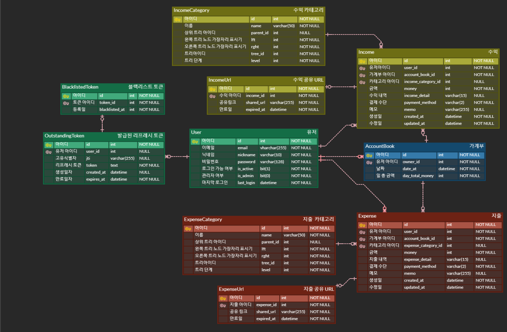
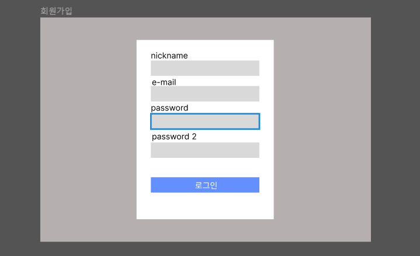
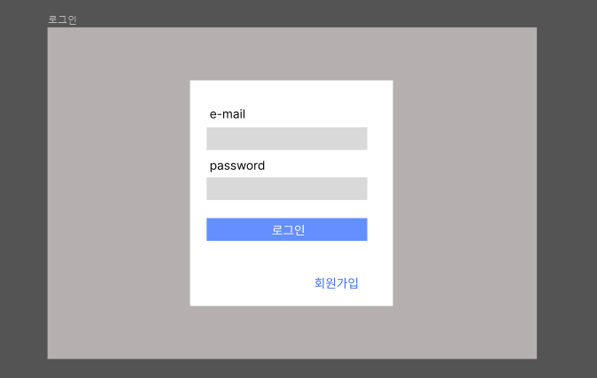
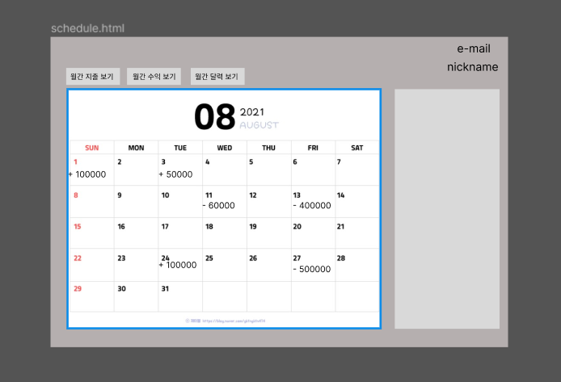

# 페이히어 가계부 프로젝트 


## ****📌 프로젝트 개요****
- Django를 활용하여 사용자에게 지출 및 소득 내역을 기록/관리를 할 수 있는 가계부를 제공합니다.
- 개발기간 : '23.02.01 ~ 23.02.04'

<br>

## ****⛓ Tech Stack****  
### Backend :    
### Management :   
### Database : 

<br>

## 📚 ****깃 브랜치 전략****
* 기능별로 나누어 issue를 적극 활용했습니다. 
* 유연한 깃 브랜치 전략을 위해 git flow를 참고했습니다
    
    - main: 제품으로 출시될 수 있는 브랜치
    - develop: 다음 출시 버전을 개발하는 브랜치 

        + develop 브랜치에 pr 또는 push할 경우 단위 테스트를 실행하는 CI를 구축했습니다.
    - feature: 기능을 개발하는 브랜치

<details>
<summary>Git Message 컨벤션</summary>
<div markdown="4">

```
################
# <타입> : <제목> 의 형식으로 제목을 아래 공백줄에 작성
# 제목은 50자 이내 / 변경사항이 "무엇"인지 명확히 작성 / 끝에 마침표 금지
# 예) :sparkles:Feat: 로그인 기능 추가, 

# 바로 아래 공백은 지우지 마세요 (제목과 본문의 분리를 위함)

################
# 본문(구체적인 내용)을 아랫줄에 작성
# 여러 줄의 메시지를 작성할 땐 "-"로 구분 (한 줄은 72자 이내)

################
# 꼬릿말(footer)을 아랫줄에 작성 (현재 커밋과 관련된 이슈 번호 추가 등)
# 예) Close #7, related_to: #7 

################
# :sparkles:Feat: 새로운 기능 추가
# :bug:Fix: 버그 수정
# :ambulance:!HOTFIX: 급한 오류 수정
# :books:Docs: 문서 수정
# :umbrella:Test: 테스트 코드 추가
# :hammer:Refact: 코드 리팩토링
# :art:Style: 코드 의미에 영향을 주지 않는 변경사항
# :lipstick:Design: CSS 등 사용자 UI디자인 변경
# :Comment: 필요한 주석 추가 및 변경	
# :Rename: 파일 혹은 폴더명을 수정하거나 옮기는 작업만의 경우
# :Remove: 파일을 삭제하는 작업만 수행한 경우
# Chore: 빌드 부분 혹은 패키지 매니저 수정사항
################
```
</div>
</details>


<br>

## 🔨 ****프로젝트 시작하기****
- 가상환경 설정(window 기준)
```linux
python -m venv venv 
pip install -r requirements.txt
```
- env 설정
```linux
SECRET_KEY='시크릿키'
DEBUG=True
MYSQL_DB=django
MYSQL_USER=root
MYSQL_PASSWORD=1234
MYSQL_HOST=localhost
MYSQL_PORT=3306
```
- 데이터베이스 반영
```
python manage.py migrate
```
- 카테고리 데이터 불러오기
```linux
python manage.py loaddata ./json_data/expense_category_data.json
python manage.py loaddata ./json_data/income_category_data.json
```
- 더미데이터 생성하기
```linux
python manage.py seed_dumy_data
```
- 서버 실행
```linux
python manage.py runserver
```


<br>

## 🛢 ****[Database ERD](https://www.erdcloud.com/d/EhwiXf9gc6qnzCNam)****


- 사용자 편리성을 위해 지출과 수익 부분을 나누어 생각하며 설계를 했습니다.
- 해당 일자의 가계부 안에서 수익과 지출을 기록할 수 있도록 가계부와 수익/지출 부분을 일대다 관계로 했습니다.
- 가계부 해당 링크만 관리할 수 있도록 일대일 관계로 매칭했습니다.
- 카테고리 또한 가계부 특성상 하위 카테고리가 많을 것을 생각하여 트리 구조로 설계했습니다.


<br>

## 🎯 ****API**** 
|Action| Method| URL|Request|Response|
|-----|----|----|----|----|
|회원가입| POST| /users/auth/signup/|email, password, repassword, nickname
|로그인(access)| POST| /users/auth/signin/|email, password|access_token, refresh_token
|로그인(refresh)| POST| /users/auth/signin/refresh/|refresh_token|access_token
|토큰 유효 확인| POST| /users/auth/verify/|token|
|로그아웃| POST| /users/auth/signout/|refresh_token
|가계부 생성| POST| /account-books/|date_at
|월간 가계부 조회| GET| /account-books/?date=||id, date_at, day_total_money
|가계부 상세 조회| GET| /account-books/details/<int: account_book_id>/|| id, date_at, day_total_money, expenses, incomes
|가계부 수정|PUT| /account-books/details/<int: account_book_id>/|date_at
|가계부 삭제|DELETE| /account-books/details/<int: account_book_id>/|
|일간 지출 내역 리스트 조회|GET| /expenses/?date=||id, money, expense_detail, payment_method
|지출 내역 생성|POST|/expenses/<int: account_book_id>/|money, expense_detail, payment_method, memo, category
|특정 지출 내역 조회|GET|/expenses/details/<int: expense_id>/||id, money, expense_detail, payment_method, memo, category
|특정 지출 내역 복제|POST|/expenses/details/<int: expense_id>/
|특정 지출 내역 수정|PUT|/expenses/details/<int: expense_id>/|money, expense_detail, payment_method, memo, category
|특정 지출 내역 삭제|DELETE|/expenses/details/<int: expense_id>/|
|특정 지출 내역 공유 단축 URL 생성|POST|/expenses/share-urls/<int: expense_id>/||shared_url
|특정 지출 내역 공유 단축 URL 조회|GET|/expenses/share-urls/?key=||id, money, expense_detail, payment_method, date_at
|지출 카테고리 리스트 조회|GET|/expenses/categories/||main_category_name, sub_category_name
|월간 지출 카테고리 검색 조회|GET|/expenses/categories/search/?date=&main=&sub=||id, money, expense_detail, payment_method
|월간 지출 내역 통계 조회|GET|/expenses/categories/stat/?date=||main_category_name, amount
|일간 수익 내역 리스트 조회|GET| /incomes/?date=||id, money, income_detail, payment_method
|수익 내역 생성|POST|/incomes/<int: account_book_id>/|money, income_detail, payment_method, memo, category
|특정 수익 내역 조회|GET|/incomes/details/<int: income_id>/||id, money, income_detail, payment_method, memo, category
|특정 수익 내역 복제|POST|/incomes/details/<int: income_id>/
|특정 수익 내역 수정|PUT|/incomes/details/<int: income_id>/|money, income_detail, payment_method, memo, category
|특정 수익 내역 삭제|DELETE|/incomes/details/<int: income_id>/|
|특정 수익 내역 공유 단축 URL 생성|POST|/incomes/share-urls/<int: income_id>/||shared_url
|특정 수익 내역 공유 단축 URL 조회|GET|/incomes/share-urls/?key=||id, money, income_detail, payment_method, date_at
|수익 카테고리 리스트 조회|GET|/incomes/categories/||main_category_name, sub_category_name
|월간 수익 카테고리 검색 조회|GET|/incomes/categories/search/?date=&main=&sub=||id, money, income_detail, payment_method
|월간 수익 내역 통계 조회|GET|/incomes/categories/stat/?date=||main_category_name, amount

<br>

## ⚙ ****기능 명세서****
## ****API 개발을 할 때 외부 개발자와 협업한다는 느낌으로 기획을 했습니다.****

### ****1. 고객은 이메일과 비밀번호 입력을 통해서 회원 가입을 할 수 있습니다.**** 
- 이메일과 닉네임 비밀번호를 받아 회원가입을 할 수 있으며 비밀번호 이중 확인을 합니다.
- simple jwt 라이브러리를 활용하여 토큰을 발행해서 인증하는 방식으로 했습니다.
- 비밀번호는 회원가입을 할 때 set_password 메소드를 사용하여 암호화되어 저장됩니다.


### ****2. 고객은 회원가입 이후, 로그인과 로그아웃을 할 수 있습니다.****
- 로그인을 통해 access token과 refresh token을 발행합니다.
- refresh token을 발행하여 access token 발행할 수 있습니다.
- token이 유효한지 확인을 위해 token verify를 활용해 안정성을 높입니다.
- 로그아웃을 통해 refresh token이 blacklist에 저장되어 재사용 방지를 막습니다.

## ****3. 고객은 로그인 이후 가계부 관련 아래의 행동을 할 수 있습니다.****

### ****a.가계부에 오늘 사용한 돈의 금액과 관련된 메모를 남길 수 있습니다.****
- 해당 일자의 가계부를 생성하고 해당 일자의 가계부의 지출/수익 내역을 생성을 통해 메모와 사용내역과 지불방법, 금액, 카테고리를 남깁니다.
- 수입/지출 내역을 생성하면 해당 일자의 총 금액이 계산됩니다.
- 트랜잭션을 안정하게 수행하기 위해 데이터베이스의 원자성이 보장되게 했습니다.  
<details>
<summary style="font-size: 15px;">금액 계산</summary>
<div markdown="1">

```python
@transaction.atomic
def sub_total_money_expense(account_book, expense):
    account_book.day_total_money -= expense
    account_book.save()

@transaction.atomic
def add_total_money_expense(account_book, expense):
    account_book.day_total_money += expense
    account_book.save()

@transaction.atomic
def mix_total_money_expense(account_book, current_money, request_money):
    if current_money < request_money:
        account_book.day_total_money -= request_money - current_money
        account_book.save()

    elif current_money > request_money:
        account_book.day_total_money += current_money - request_money
        account_book.save()
```

</div>
</details>

<br>

### ****b.가계부에서 수정을 원하는 내역은 금액과 메모를 수정할 수 있습니다.****
- 해당 일자의 가계부를 다른 날짜로 수정할 수 있으며 지출/수익 내역의 메모와 사용내역과 지불방법, 금액, 카테고리를 수정할 수 있습니다
- 수입/지출 내역을 수정하면 해당 일자의 총 금액이 계산됩니다. (a와 동일)

### ****c. 가계부에서 삭제를 원하는 내역은 삭제할 수 있습니다.****
- 해당일자의 가계부를 삭제할 수 있고 지출/수익 내역을 삭제할 수 있습니다
- 수입/지출 내역을 삭제하면 해당 일자의 총 금액이 계산됩니다. (a와 동일)
### ****d. 가계부에서 이제까지 기록한 가계부 리스트를 볼 수 있습니다.****
- 월간 가계부 리스트를 조회하도록 했으며 지출/수익 리스트를 조회할 수 있도록 했습니다.
### ****e. 가계부에서 상세한 세부 내역을 볼 수 있습니다.****
- 해당 일자의 가계부를 상세조회하면 지출/수익 내역을 볼 수 있으며 그 지출/수익 내역의 세부 내역을 볼 수 있도록 했습니다. 
### ****f. 가계부의  세부 내역을 복제할 수 있습니다.****
- 해당 일자의 가계부에 지출/수익 내역을 복제할 수 있도록 했습니다. 
- 복제가 되면 해당 일자의 총 금액이 계산됩니다. (a와 동일)
<details>
<summary style="font-size: 15px;">지출 복제 코드</summary>
<div markdown="1">

```python
class ExpenseDetailView(APIView):
    permission_classes = [IsOwner]

    def get_objects(self, expense_id):
        expense = get_object_or_404(Expense, id=expense_id)
        self.check_object_permissions(self.request, expense)
        return expense

    def post(self, reuqest, expense_id):
        expense = self.get_objects(expense_id)
        expense.id = None
        expense.save()
        ExpenseCalcUtil.sub_total_money_expense(
            expense.account_book, expense.money
            )
        return Response({"message": "복사 완료"}, status=status.HTTP_200_OK)
```

</div>
</details>

<br>

### ****g. 가계부의 특정 세부 내역을 공유할 수 있게 단축 URL을 만들 수 있습니다. (단축 URL은 특정 시간 뒤에 만료되어야 합니다. )****
[공유 링크 생성]

1. 지출/수익 상세 내역을 가져와 id 값을 암호화(uidb64, uuid)하여 만료시간과 단축 공유 URL을 저장하고 반환합니다.

[공유 링크 조회]

2. 암호화된 단축 공유 URL을 복호화하여 id값으로 지출/수익 상세 내역을 찾아 보여주며 시간이 만료되었으면 에러를 보여줍니다. 
<details>
<summary style="font-size: 15px;">지출 공유 링크 코드</summary>
<div markdown="1">

```python
# expense.views.py
class ExpenseShareUrlCreateView(APIView):
    permission_classes = [IsOwner]

    def get_objects(self, expense_id):
        expense = get_object_or_404(Expense, id=expense_id)
        self.check_object_permissions(self.request, expense)
        return expense

    def post(self, request, expense_id):
        try:
            expense = self.get_objects(expense_id)
            shared_url = UrlUtil.get_share_link(request, expense)
            expired_at = UrlUtil.get_share_link_expired_at()
            ExpenseURL.objects.create(shared_url=shared_url, expired_at=expired_at, expense_id=expense.id)
            return Response({"단축 URL(1일 제한)": shared_url}, status=status.HTTP_201_CREATED)

        except IntegrityError:
            return Response({"message": "해당 지출 내역의 공유 링크가 존재합니다. "},status=status.HTTP_208_ALREADY_REPORTED)


class ExpenseShareUrlView(APIView):
    permission_classes = [IsAuthenticated]

    def get(self, request):
        encode_key = request.GET.get("key", None)
        expense_id = UrlUtil.get_query_id(encode_key)
        expense_url = get_object_or_404(ExpenseURL, expense_id=expense_id)
        if expense_url.expired_at < timezone.now():
            return Response({"message": "만료된 URL 입니다."}, status=status.HTTP_400_BAD_REQUEST)
        serializer = ExpenseShareUrlSerializer(expense_url.expense)
        return Response(serializer.data, status=status.HTTP_200_OK)

# payhere.utils.py
class UrlUtil:
    def get_share_link_expired_at():
        expired_at = timezone.now() + timezone.timedelta(days=1)
        return expired_at

    def get_share_link(request, query):
        uid = str(uuid.uuid4())[:7]
        uidb64 = urlsafe_base64_encode(smart_bytes(query.id))
        encode_key = uidb64 + uid
        currnt_site = f"{get_current_site(request).domain}/"
        shared_url = "http://" + currnt_site + encode_key
        return shared_url

    def get_query_id(encode_key):
        uidb64 = encode_key[:-7]
        query_id = force_str(urlsafe_base64_decode(uidb64))
        return query_id
```

</div>
</details>

<br>

## ****로그인하지 않은 고객은 가계부 내역에 대한 접근 제한 처리가 되어야 합니다.****
[IsOwner]
1. custom permission을 만들어 해당 사용자만 접근이 가능하도록 했습니다.

[IsAuthenticated]
1. 로그인된 사용자만 접근이 가능하도록 했습니다. 

<details>
<summary style="font-size: 15px;">IsOnwer 코드</summary>
<div markdown="1">

```python
# payhere.permissions.py
class IsOwner(BasePermission):
    def has_object_permission(self, request, view, obj):
        user = request.user
        if obj.owner == user:
            return True

        if user.is_authenticated or user.is_anonymous:
            response = {"detail": "접근 권한 없습니다."}
            raise GenericAPIException(status_code=status.HTTP_403_FORBIDDEN, detail=response)

# views.py
permission_classes = [IsOwner]

def get_objects(self, account_book_id):
    account_book = get_object_or_404(AccountBook, id=account_book_id)
    self.check_object_permissions(self.request, account_book)
    return account_book
```

</div>
</details>

<br>

## ****카테고리(Django-MPTT 사용)****
[설계]
- 사용자가 편의성을 위해 카테고리를 생성하게 하는 것보다 고정된 카테고리를 제공하여 사용자 접근성을 증대시키려는 목적이었습니다.
- 쿼리를 삽입, 삭제를 하지않고 조회가 잦아질 것 같아 Django-MPTT를 사용하여 쿼리최적화에 초점을 맞췄습니다..
- 고정된 카테고리를 위해 지출/수익 내역에 들어갈 사전 조사를 하여 JSON데이터로 만들었습니다.

<details>
<summary style="font-size: 15px;">카테고리 모델 코드</summary>
<div markdown="1">

```python
# expense.models.py
class ExpenseCategory(MPTTModel):
    name = models.CharField("이름", max_length=50, unique=True, error_messages={"unique": "이미 사용중인 카테고리입니다."})
    parent = TreeForeignKey("self", verbose_name="부모", on_delete=models.CASCADE, null=True, blank=True, related_name="children", db_index=True)

    class MPTTMeta:
        order_insertion_by = ["name"]

    class Meta:
        db_table = "ExpenseCategory"

    def __str__(self):
        return self.name

```

</div>
</details>

<br>

### ****카테고리 리스트****
[설계]
- 외부 개발자와 협업을 한다고 하면 어떤 카테고리가 있는지 보여주기 위해 API 개발을 했습니다.

[구현]
- 하위 카테고리가 상위 카테고리에 종속되어 딕셔너리로 만들어 반환합니다. 


<details>
<summary style="font-size: 15px;">카테고리 리스트 코드</summary>
<div markdown="1">

```python
# expense.views.py
class ExpenseCategoryView(APIView):
    def get(self, reuqest):
        category_data = {}
        
        for i in range(1, 15):
            main_category = get_object_or_404(ExpenseCategory, id=i)
            sub_categories = main_category.get_descendants(include_self=False)
            sub_categories_serializer = ExpenseCategorySerializer(sub_categories, many=True)
            category_data[f"({i}) {main_category.name}"] = sub_categories_serializer.data
        return Response(category_data, status=status.HTTP_200_OK)
```


</div>
</details>

<br>


### ****카테고리로 검색****
[설계]
- 사용자가 카테고리 별로 모아서 편의성을 향상시키기 위해 만들었습니다.

[구현]
- 월간으로 카테고리로 지출/수익을 조회할 수 있게 했으며 해당 카테고리가 없다면 월간에 해당하는 
    지출/수익 내역 모두를 보여줍니다.

<details>
<summary style="font-size: 15px;">카테고리 검색 조회 코드</summary>
<div markdown="1">

```python
# expense.views.py
class ExpenseCategorySearchView(APIView):
    def get(self, request):
        try:
            date = request.GET.get("date", None).split("-")
            main = request.GET.get("main", None)
            sub = request.GET.get("sub", None)
            
            year = date[0]
            month = date[1]

            if main or sub:
                # 해당 카테고리가 있을 경우
                select_expenses = (
                    Expense.objects.select_related("account_book").select_related("category").filter \
                    (account_book__in=get_list_or_404(AccountBook, date_at__year=year, date_at__month=month, owner=request.user),
                    category__in=get_list_or_404(ExpenseCategory, Q(name=main) | Q(name=sub))))
                select_serializer = ExpenseSearchListSerializer(select_expenses, many=True)
                return Response(select_serializer.data, status=status.HTTP_200_OK)

            # 해당 카테고리가 없을 경우 월간 리스트 조회
            all_expenses = Expense.objects.select_related("account_book").filter \
                (account_book__in=get_list_or_404(AccountBook,date_at__year=year, date_at__month=month, owner=request.user))
            all_serializer = ExpenseSearchListSerializer(all_expenses, many=True)
            return Response(all_serializer.data, status=status.HTTP_200_OK)

        except IndexError:
            return Response({"message": "올바른 매개변수의 날짜를 입력해주세요.(Ex: YYYY-MM)"}, status=status.HTTP_400_BAD_REQUEST)
```


</div>
</details>

<br>

## ****월간 통계 조회****
[설계]
- 사용자가 월간에 카테고리 별로 얼만큼 금액을 지출/수익을 한번에 알게 하고 사용자 접근성을 용이하게 하기 위해 구현했습니다.

[구현]
- 월간 지출/수익에 해당하는 내역을 불러와 중복이 제거되고 리스트로 만들어진 카테고리를 반복문으로 상위 카테고리를 기준으로 총액을 구해 반환합니다.  

<details>
<summary style="font-size: 15px;">월간 통계 조회 코드</summary>
<div markdown="1">

```python
#expense.views.py
class ExpenseCategoryStatView(APIView):
    permission_classes = [IsAuthenticated]

    def get_amount_for_category_null(self, expense_list):
        expenses = expense_list.filter(category__isnull=True)

        amount = 0

        for expense in expenses:
            amount += expense.money
        return {"amount": str(amount)}

    def get_amount_for_category(self, category, expense_list):
        expenses = expense_list.filter(category__in=ExpenseCategory.objects.get(name=category).get_descendants(include_self=True))

        amount = 0

        for expense in expenses:
            amount += expense.money
        return {"amount": str(amount)}

    def get_category(self, expense):
        try:
            if not expense.category.parent:
                return expense.category

        except AttributeError:
            return None

    def get(self, request):
        try:
            date = request.GET.get("date", None).split("-")
            
            year = date[0]
            month = date[1]

            expenses = (
                Expense.objects.select_related("account_book").select_related("category").filter \
                (account_book__in=get_list_or_404(AccountBook, date_at__year=year, date_at__month=month, owner=request.user)))

            final = {}
            categories = list(set(map(self.get_category, expenses)))

            for category in categories:
                if category == None:
                    final["없음"] = self.get_amount_for_category_null(expenses)
                    
                else:
                    final[str(category)] = self.get_amount_for_category(category, expenses)
            return Response({"category_data": final}, status=status.HTTP_200_OK)

        except IndexError:
            return Response({"message": "올바른 매개변수의 날짜를 입력해주세요.(Ex: YYYY-MM)"}, status=status.HTTP_400_BAD_REQUEST)
```


</div>
</details>

<br>

## 🤙 ****Test Code Case****

### 단위 테스트 코드를 통해 안정성있는 기능 구현에 초점을 맞췄습니다.
<details>
<summary style="font-size: 18px;">USER TEST CODE</summary>
<div markdown="1">


## 회원가입
1. 회원가입 성공
2. 회원가입 실패(이메일 빈칸)
3. 회원가입 실패(이메일 형식)
4. 회원가입 실패(이메일 중복)
5. 회원가입 실패(닉네임 빈칸)
6. 회원가입 실패(닉네임 유효성검사)
7. 회원가입 실패(닉네임 중복)
8. 회원가입 실패(비밀번호 빈칸)
9. 회원가입 실패(비밀번호확인 빈칸)
10. 회원가입 실패(비밀번호, 비밀번호 확인 일치 )
11. 회원가입 실패(비밀번호 유효성 검사)

## 로그인
12. (access token)로그인 성공
13. (access token)로그인 실패
14. (refresh_token)로그인 성공
15. (refresh_token)로그인 실패(refresh 입력안했을 때)
16. (refresh_token)로그인 실패(access 토큰 넣었을 때)

## 토큰 유효 확인
17. access 토큰 유효 (성공)
18. refresh 토큰 유효 (성공)
19. 토큰 유효하지 않음 (실패)

## 로그아웃
20.  (refresh_token)로그아웃 성공
21.  (refresh_token)로그아웃 실패(refresh 입력안했을 때)
22.  (refresh_token)로그아웃 실패(access 토큰 넣었을 때)

</div>
</details>

<P>

<details>
<summary style="font-size: 18px;">ACCOUNT BOOK TEST CODE</summary>
<div markdown="2">

## 가계부 생성, 가계부 월간 조회
1. 가계부 생성 성공
2. 가계부 생성 실패 (날짜 중복)
3. 가계부 생성 실패 (날짜 형식이 아닐 때)
4. 가계부 생성 실패 (날짜가 빈칸일 때)
5. 가계부 생성 실패 (날짜 필드가 없을 때)
6. 가계부 생성 실패 (비회원일 때)
7. 가계부 월간 조회 성공
8. 가계부 월간 조회 실패 (url 매개변수 설정 잘못되었을 때)
9. 가계부 월간 조회 실패 (비회원일 때)
10. 가계부 월간 조회 실패 (가계부가 존재하지 않을 때)

# 가계부 상세 조회, 수정, 삭제
11. 가계부 상세 조회 성공
12. 가계부 상세 조회 실패 (비회원일 때)
13. 가계부 상세 조회 실패 (다른 회원일 때)
14. 가계부 상세 조회 실패 (가계부가 존재하지 않을 때)
15. 가계부 수정 성공
16. 가계부 수정 실패 (날짜가 중복되었을 때)
17. 가계부 수정 실패 (날짜 형식이 아닐 때)
18. 가계부 수정 실패 (비회원일 때)
19. 가계부 수정 실패 (다른 회원일 때)
20. 가계부 수정 실패 (가계부가 존재하지 않을 때)
21. 가계부 삭제 성공
22. 가계부 삭제 실패 (비회원일 때)
23. 가계부 삭제 실패 (다른 회원일 때)
24. 가계부 삭제 실패 (가계부가 존재하지 않을 때)
</div>
</details>

<P>

<details>
<summary style="font-size: 18px;">EXPENSE TEST CODE</summary>
<div markdown="3">

## 월간 지출 내역 리스트 조회
1. 월간 지출 내역 리스트 조회 성공
2. 월간 지출 내역 리스트 조회 실패 (비회원일 때)
3. 월간 지출 내역 리스트 조회 실패 (다른 회원일 때)
4. 월간 지출 내역 리스트 조회 실패 (가계부 찾을 수 없음)

## 지출 내역 생성
5. 지출 내역 생성 성공
6. 지출 내역 생성 실패 (money 형식이 안 맞을 때)
7. 지출 내역 생성 실패 (money가 빈칸일 때)
8. 지출 내역 생성 실패 (money 필드가 없을 때)
9. 지출 내역 생성 실패 (비회원일 때)
10. 지출 내역 생성 실패 (다른 회원일 때)
11. 지출 내역 생성 실패 (가계부를 찾을 수 없음)

## 지출 내역 상세 조회, 복제, 수정, 삭제
12. 지출 내역 상세 조회 성공
13. 지출 내역 상세 조회 실패 (비회원일 때)
14. 지출 내역 상세 조회 실패 (다른 회원일 때)
15. 지출 내역 상세 조회 실패 (지출 내역 찾을 수 없을 때)
16. 지출 내역 복제 성공
17. 지출 내역 복제 실패 (비회원일 때)
18. 지출 내역 복제 실패 (다른 회원일 때)
19. 지출 내역 복제 실패 (지출 내역 찾을 수 없을 때)
20. 지출 내역 수정 성공
21. 지출 내역 수정 성공 (money 필드가 없을 때)
22. 지출 내역 수정 실패 (money가 빈칸일 때)
23. 지출 내역 수정 실패 (money가 형식이 안맞을 때)
24. 지출 내역 수정 실패 (비회원일 때)
25. 지출 내역 수정 실패 (다른 회원일 때)
26. 지출 내역 수정 실패 (지출 내역을 찾을 수 없을 때)
27. 지출 내역 삭제 성공
28. 지출 내역 삭제 실패 (비회원일 때)
29. 지출 내역 삭제 실패 (다른 회원일 때)
30. 지출 내역 삭제 실패 (지출 내역을 찾을 수 없을  때)

## 지출 내역 공유 단축 URL 생성
31. 지출 내역 공유 단축 URL 생성 성공
32. 지출 내역 공유 단축 URL 생성 실패 (지출 내역에 링크가 존재할 때)
33. 지출 내역 공유 단축 URL 생성 실패 (비회원일 때)
34. 지출 내역 공유 단축 URL 생성 실패 (다른 회원일 때)
35. 지출 내역 공유 단축 URL 생성 실패 (지출 내역을 찾을 수 없을 때)

## 지출 내역 공유 단축 URL 조회
36. 지출 내역 공유 단축 URL 조회 성공
37. 지출 내역 공유 단축 URL 조회 실패 (링크 시간이 만료 되었을 때)
38. 지출 내역 공유 단축 URL 조회 실패 (비회원일 때)
39. 지출 내역 공유 단축 URL 조회 실패 (지출내역을 찾을 수 없을 때)

## 지출 카테고리 리스트 조회
40. 지출 카테고리 리스트 조회 성공
41. 지출 카테고리 리스트 조회 실패 (비회원일 때)

## 월간 지출 카테고리 검색 조회
42. 월간 지출 카테고리 검색 조회 성공
43. 월간 지출 카테고리 검색 조회 성공 (모든 쿼리를 불러올 때)
44. 월간 지출 카테고리 검색 조회 실패 (date 매개변수가 잘못되었을 때)
45. 월간 지출 카테고리 검색 조회 실패 (비회원일 때)
46. 월간 지출 카테고리 검색 조회 실패 (main, sub 매개변수가 잘못 되었을 때)

## 월간 지출 카테고리 통계 조회
47. 월간 지출 카테고리 통계 조회 성공
48. 월간 지출 카테고리 통계 조회 실패 (date 매개변수가 잘못되었을 때)
49. 월간 지출 카테고리 통계 조회 실패 (비회원일 때)
50. 월간 지출 카테고리 통계 조회 실패 (지출 내역을 찾을 수 없을 때)
    
</div>
</details>

<P>

<details>
<summary style="font-size: 18px;">INCOME TEST CODE</summary>
<div markdown="4">

## 월간 수익 내역 리스트 조회
1. 월간 수익 내역 리스트 조회 성공
2. 월간 수익 내역 리스트 조회 실패 (비회원일 때)
3. 월간 수익 내역 리스트 조회 실패 (다른 회원일 때)
4. 월간 수익 내역 리스트 조회 실패 (가계부 찾을 수 없음)

## 수익 내역 생성
5. 수익 내역 생성 성공
6. 수익 내역 생성 실패 (money 형식이 안 맞을 때)
7. 수익 내역 생성 실패 (money가 빈칸일 때)
8. 수익 내역 생성 실패 (money 필드가 없을 때)
9. 수익 내역 생성 실패 (비회원일 때)
10. 수익 내역 생성 실패 (다른 회원일 때)
11. 수익 내역 생성 실패 (가계부를 찾을 수 없음)

## 수익 내역 상세 조회, 복제, 수정, 삭제
12. 수익 내역 상세 조회 성공
13. 수익 내역 상세 조회 실패 (비회원일 때)
14. 수익 내역 상세 조회 실패 (다른 회원일 때)
15. 수익 내역 상세 조회 실패 (수익 내역 찾을 수 없을 때)
16. 수익 내역 복제 성공
17. 수익 내역 복제 실패 (비회원일 때)
18. 수익 내역 복제 실패 (다른 회원일 때)
19. 수익 내역 복제 실패 (수익 내역 찾을 수 없을 때)
20. 수익 내역 수정 성공
21. 수익 내역 수정 성공 (money 필드가 없을 때)
22. 수익 내역 수정 실패 (money가 빈칸일 때)
23. 수익 내역 수정 실패 (money가 형식이 안맞을 때)
24. 수익 내역 수정 실패 (비회원일 때)
25. 수익 내역 수정 실패 (다른 회원일 때)
26. 수익 내역 수정 실패 (수익 내역을 찾을 수 없을 때)
27. 수익 내역 삭제 성공
28. 수익 내역 삭제 실패 (비회원일 때)
29. 수익 내역 삭제 실패 (다른 회원일 때)
30. 수익 내역 삭제 실패 (수익 내역을 찾을 수 없을  때)

## 수익 내역 공유 단축 URL 생성
31. 수익 내역 공유 단축 URL 생성 성공
32. 수익 내역 공유 단축 URL 생성 실패 (수익 내역에 링크가 존재할 때)
33. 수익 내역 공유 단축 URL 생성 실패 (비회원일 때)
34. 수익 내역 공유 단축 URL 생성 실패 (다른 회원일 때)
35. 수익 내역 공유 단축 URL 생성 실패 (수익 내역을 찾을 수 없을 때)

## 수익 내역 공유 단축 URL 조회
36. 수익 내역 공유 단축 URL 조회 성공
37. 수익 내역 공유 단축 URL 조회 실패 (링크 시간이 만료 되었을 때)
38. 수익 내역 공유 단축 URL 조회 실패 (비회원일 때)
39. 수익 내역 공유 단축 URL 조회 실패 (수익 내역을 찾을 수 없을 때)

## 수익 카테고리 리스트 조회
40. 수익 카테고리 리스트 조회 성공
41. 수익 카테고리 리스트 조회 실패 (비회원일 때)

## 월간 수익 카테고리 검색 조회
42. 월간 수익 카테고리 검색 조회 성공
43. 월간 수익 카테고리 검색 조회 성공 (모든 쿼리를 불러올 때)
44. 월간 수익 카테고리 검색 조회 실패 (date 매개변수가 잘못되었을 때)
45. 월간 수익 카테고리 검색 조회 실패 (비회원일 때)
46. 월간 수익 카테고리 검색 조회 실패 (main, sub 매개변수가 잘못 되었을 때)

## 월간 수익 카테고리 통계 조회
47. 월간 수익 카테고리 통계 조회 성공
48. 월간 수익 카테고리 통계 조회 실패 (date 매개변수가 잘못되었을 때)
49. 월간 수익 카테고리 통계 조회 실패 (비회원일 때)
50. 월간 수익 카테고리 통계 조회 실패 (수익 내역을 찾을 수 없을 때)
    
</div>
</details>

